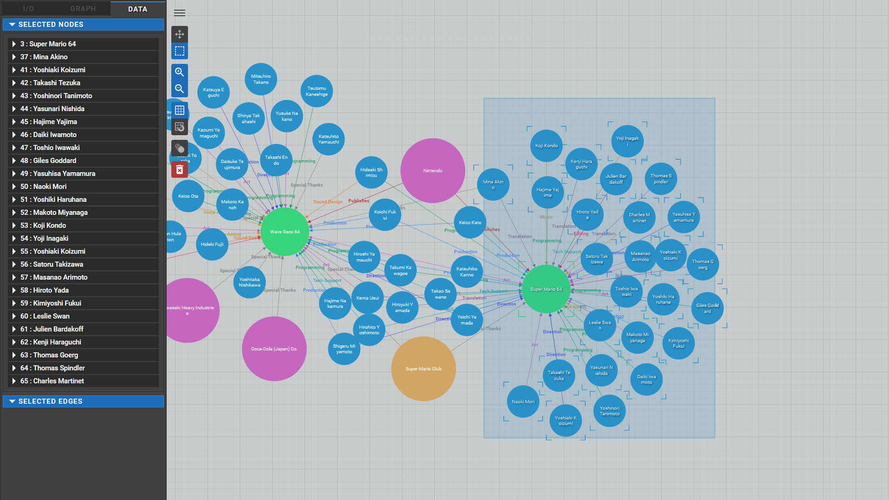

# React-NodeGraphEditor
Basic node graph editor created in React. Uses CSS Modules, MobX, JSDoc, and d3-force.

[Live Demo](http://www.chassebrook.com/graphviz/)

## DESCRIPTION
With this tool you can import, edit and export a simple node graph.

This was originally designed to act as a foundation for a visual scripting tool similar to Twine. Underneath, its architecture is largely inspired by Unreal Engine's blueprint editor with the Node->Pin->Edge command pattern. This project has since been redirected and repurposed to visualize big data for the United States Army Operational Environment (specific source not included).

## SCREENSHOTS
  

## CORE FEATURES
- Fully-functional editor that allows for complete node graph editing inspired by game visual scripting tools such as Twine and Unreal Engine's Blueprint
- Import/Export in both custom GraphViz format and GraphJSON
- Integration with D3 force layout for auto-placement and physics
- Several graph options such as pan, zoom, grid toggle, grid snap, physics toggling
- Creating, removing, dragging, individual and marquee selection of nodes
- Node popup menu for deleting and linking of other nodes
- Basic customization and toggling of node and edge types
- All models are documented in JSDOC format. Use **npm run doc** to generate.
- Setup to be exported by external packages using **npm run build:node** which allows for imports with **import X from "graphviz/lib/Y"**
